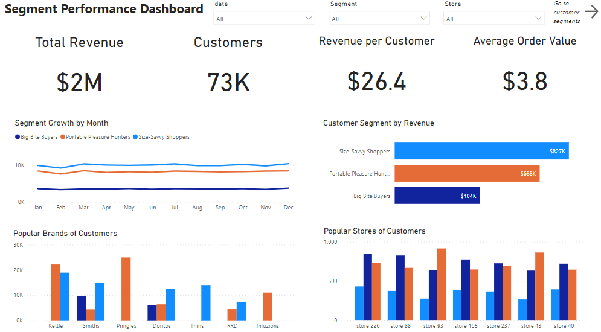
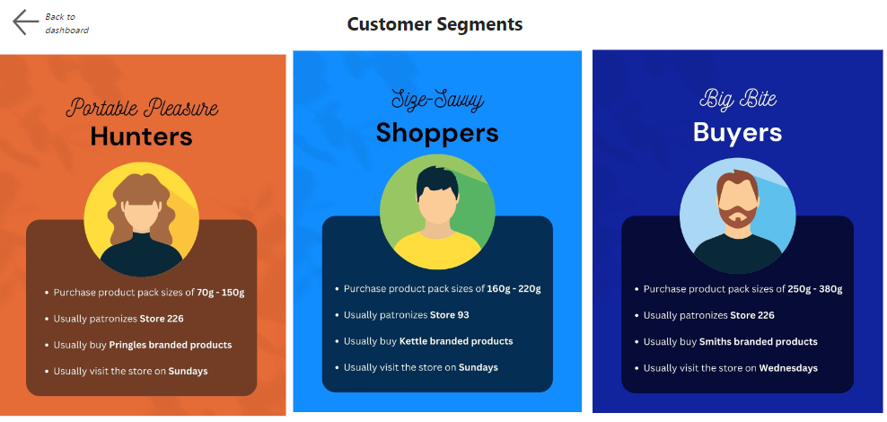

# Meet the Customer Clusters: Preferences and Habits
*This project displays my skills in ML model building using Python, PowerBI, and data storytelling.*

*Image by [vectorjuice](https://www.freepik.com/author/vectorjuice) on freepik*

## Introduction

You are part of a company's retail analytics team and have been approached by Julia, the Category Manager for Chips, who wants to better understand the types of customers who purchase Chips and their purchasing behavior within the region.
The insights from your analysis will feed into the supermarket’s strategic plan for the chip category in the next half year.

## Problem Statement

What are the customer segments in the supermarket and what is the purchasing behavior of each segment?

## Skills/Concepts Demonstrated

The following tools and concepts were applied in this project:

- **Python** was used to wrangle the data, explore the data, and build the customer segmentation model.

- **PowerBI** was used to create visualizations for presentation

- **Customer Segmentation Modelling** specifically the KPrototypes

## Data Sourcing

The data comprised the: 

- [QVI Transaction Data](QVI_transaction_data.xlsx)

- [QVI Purchase Behavior](QVI_purchase_behaviour.csv)

## Methodology

- Business problem understanding

- Problem statement generation

- Domain knowledge acquisition

- Data transformation and cleaning

- Exploratory data analysis

    -   Univariate analysis

    - Bivariate analysis

    - Multivariate analysis

- Customer Segmentation using KPrototypes

- Insights generation

- Dashboard building

## Analysis and Visualizations

**click the image above to be directed to the interactive dashboard**

- There are 3 major clusters of customers in the supermarket. 

- Customers in cluster 2 are the low-ended customers who buy products of the least pack sizes (70g - 150g)

- Customers in cluster 0 are the medium-ended customers who buy products of pack sizes on average (160g - 220g)

- Customers in cluster 1 are the high-ended customers who buy products of the large pack sizes (250g - 380g)

- Customers in cluster 0 are the majority of the supermarket while cluster 1 are the minority

- Customers in cluster 1 spend the highest amount on average

- Customers in cluster 0 mostly patronize store 93

- Customers in cluster 1 and 2 mostly patronize store 226

- Customers in cluster 0 usually buy Kettle branded products

- Customers in cluster 1 usually buy Smiths branded products

- Customers in cluster 2 usually buy pringles branded products

- Customers in cluster 1 usually visit the stores on Wednesday

- Customers in cluster 0 and 2 usually visit the stores on Sunday

Let's give these clusters a name, shall we?

- Cluster 0 - Size Savvy Shoppers
- Cluster 1 - Portable Pleasure Hunters
- Cluster 2 - Big Bite Buyers

## Recommendations for Julia

- Develop targeted marketing campaigns for each customer cluster based on their preferences and buying patterns. Tailor your messaging and promotions to appeal to each cluster's specific needs and desires.

- Optimize your product assortment based on the preferences of each customer cluster. Stock a wide variety of pack sizes for each product category, with a focus on the preferred pack sizes and brands of each cluster.

- Enhance the store layout and product placement to cater to the preferences of each cluster. Place products preferred by each cluster in prominent locations within the store especially the most visited, making them easily accessible and visible.

- Analyze the performance of store 93, which attracts most customers from cluster 0, and identify ways to further optimize its offerings to cater to their needs. Similarly, assess the performance of store 226 and ensure it is well-stocked with the preferred products of customers from clusters 1 and 2.

- Collaborate with Kettle, Smiths, and Pringles (the preferred brands for each cluster) to develop joint marketing initiatives and promotions that target their respective customer segments.

- Train staff to identify opportunities for cross-selling and upselling based on the preferences of each cluster. Recommend complementary products or larger pack sizes to customers during their shopping experience.

- Implement personalized marketing strategies, such as targeted email campaigns or personalized product recommendations, based on the preferences and purchasing history of each cluster.